<h1 align="center">CiviSense</h1></br>

<p align="center">
  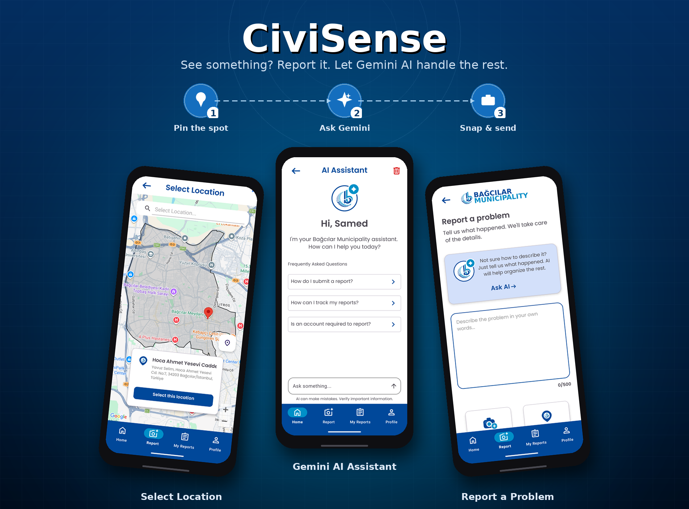
</p>

<p align="center">
  <a href="https://opensource.org/licenses/Apache-2.0"></a>
  <a href="https://android-arsenal.com/api?level=24"></a>
  <a href="https://kotlinlang.org/"></a>
  <a href="https://firebase.google.com/"></a>
  <a href="https://linkedin.com/in/samedtevin"></a>
</p><br>

<p align="center">
A modern Android civic engagement and reporting application designed to bridge citizens with municipal services. It enables residents to submit urban issue reports with GPS locations and photo evidence, track progress in real-time, view announcements, and chat with an integrated <b>Gemini AI Smart Assistant</b>.
</p>

---

## Preview

<p align="center">
  
  
  
</p>

### Onboarding & Authentication
<p align="center">
  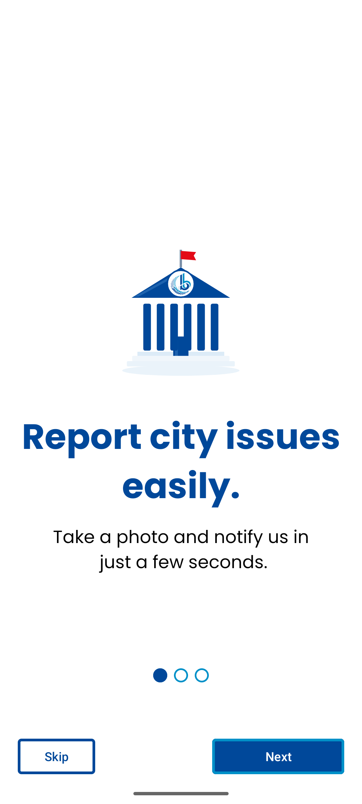
  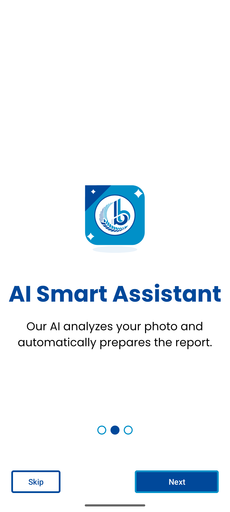
  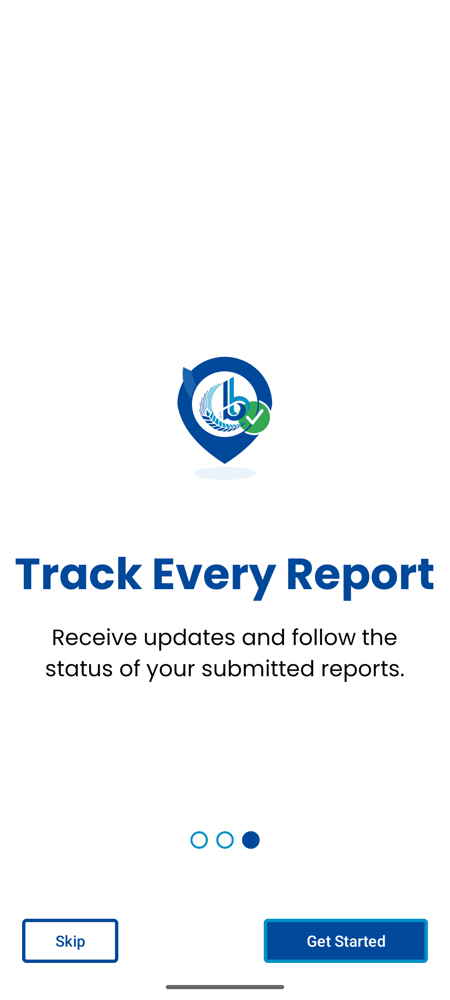
  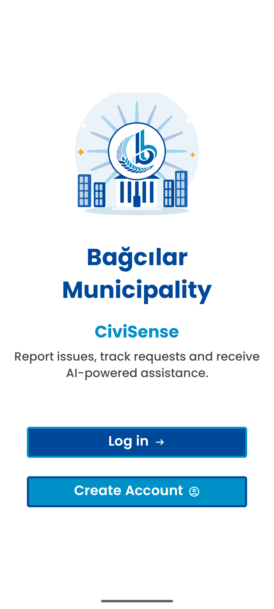
  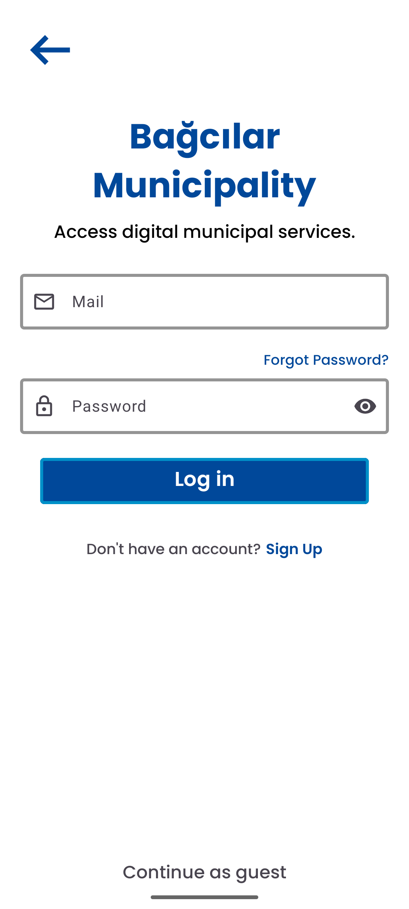
</p>

### Gemini AI Smart Assistant
<p align="center">
  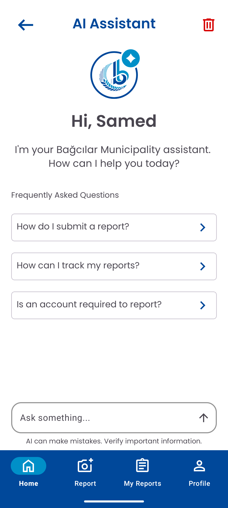
  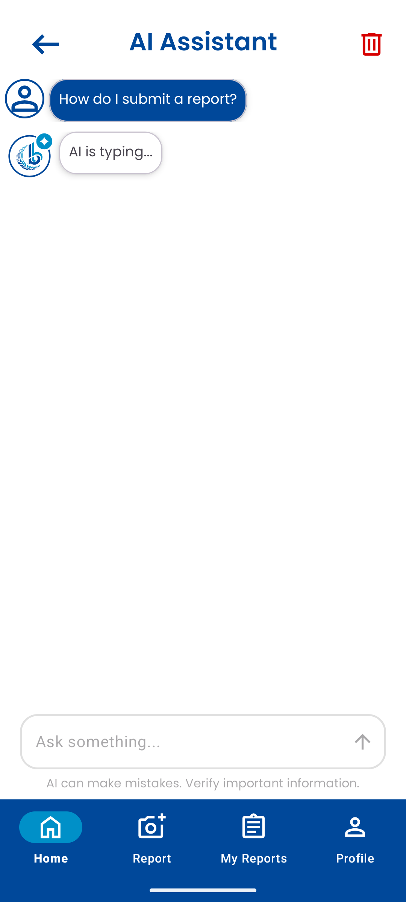
  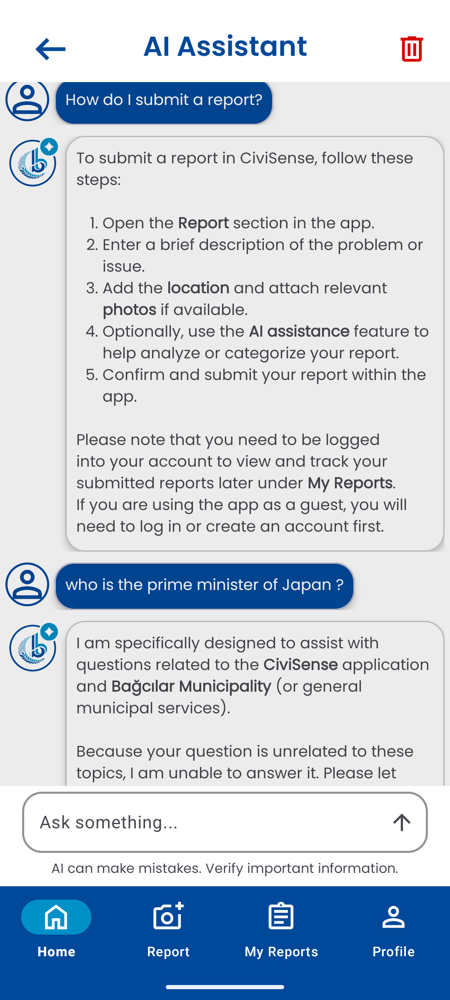
</p>

### Issue Reporting & Location Selection
<p align="center">
  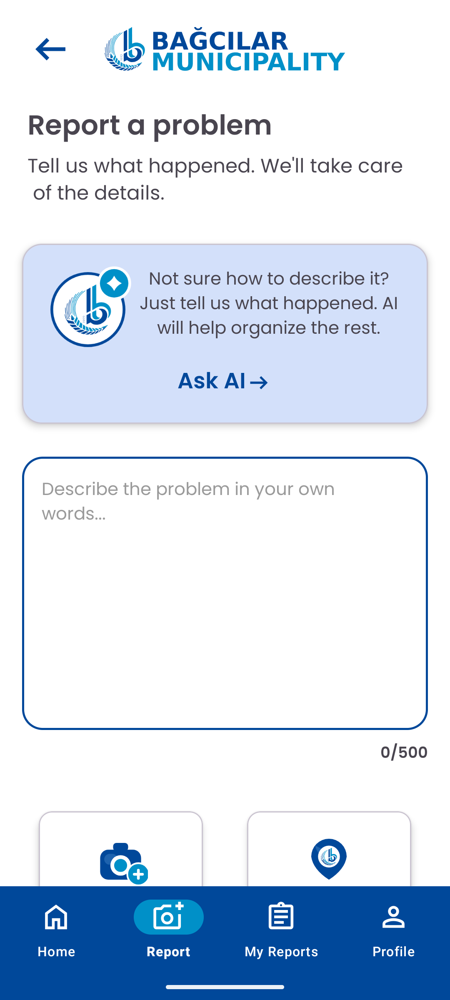
  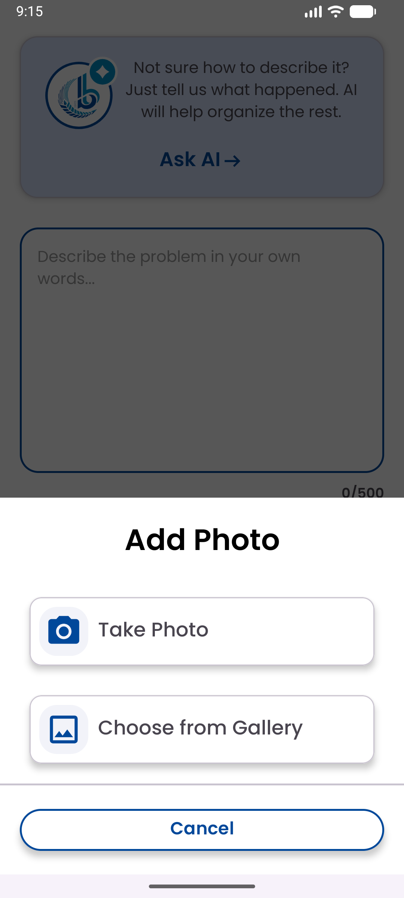
  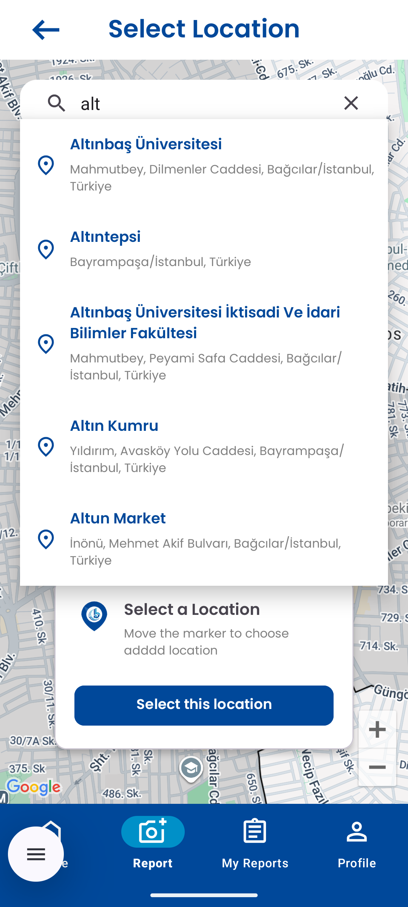
  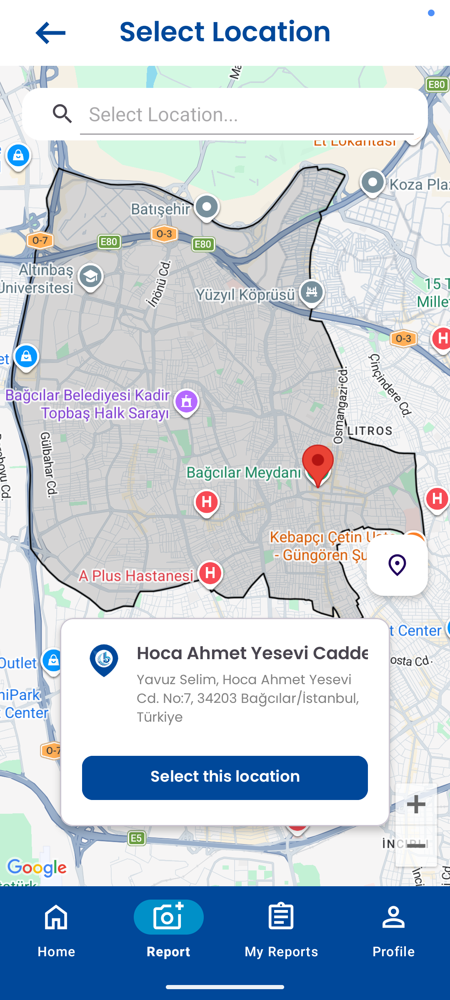
</p>

### Report Review & User Profile
<p align="center">
  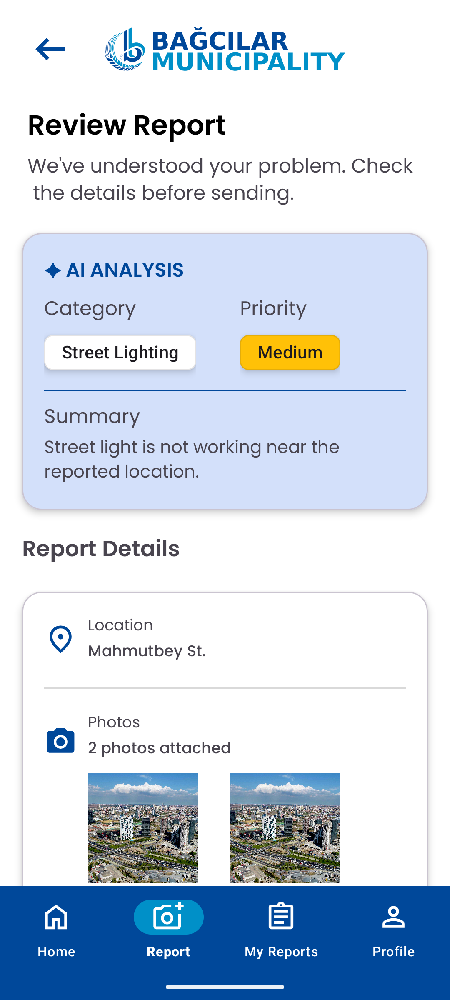
  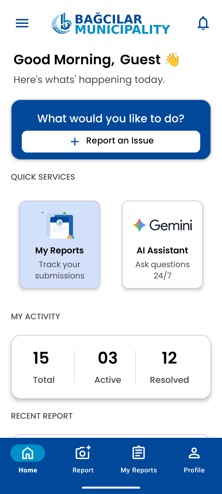
  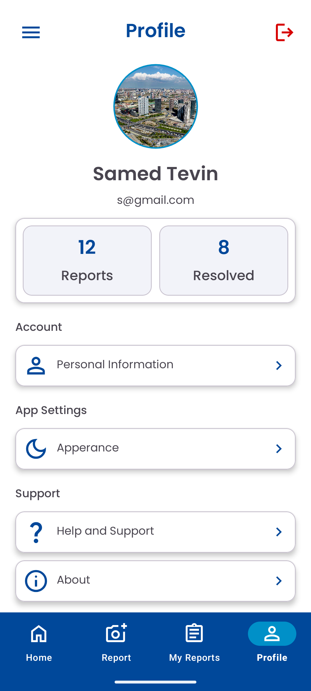
  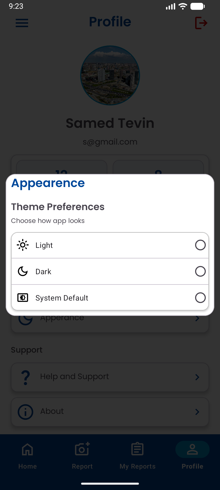
</p>

---

## Key Features

- **🤖 Gemini AI Smart Assistant**:
  - Powered by Firebase AI Engine (`gemini-3.6-flash`).
  - Custom prompt engineering for municipal service queries, reporting guidance, and automated off-topic filtering.

- **🗺️ Geofenced Boundary Enforcement (GeoJSON)**:
  - Location validation using local district polygon overlays (`ilce_geojson.json`).
  - Restricts report submissions exclusively within official Bağcılar municipality limits.

- **📍 Interactive Maps & Places API Integration**:
  - Google Places API SDK integration for real-time autocomplete address predictions.
  - Interactive map pin selection, draggable markers, and reverse geocoding for precise location assignment.

- **📢 Dynamic Municipal Announcements Feed**:
  - Live notice feed showcasing community programs, municipal news, and local updates with detail view screens.

- **🔐 Firebase Authentication & Guest Access**:
  - Firebase Auth powering email/password registration, login, password resets, and email verification.
  - Guest Mode support allowing citizens to explore municipal features prior to account creation.

- **🎨 Onboarding & Dialog Components**:
  - ViewPager2 onboarding experience with Worm Dots Indicator.
  - Custom photo picker BottomSheet, appearance selection dialog, and terms/privacy policy dialogs.

---

## 🚧 Roadmap & Future Enhancements

As this project was developed during an intensive **20-day internship**, active development will continue post-internship. Planned upcoming features include:

- [ ] **Dynamic Theme Engine**: Full persistence and application of Light / Dark / System themes via DataStore & AppCompat (UI dialog layout ready).
- [ ] **Cloud Firestore Report Sync**: Real-time cloud persistence for submitted issue reports and photos (UI flow & repository models ready).
- [ ] **Profile & Personal Info Management**: Editing user profile details and profile picture uploads.
- [ ] **Push Notifications**: Real-time status update alerts via Firebase Cloud Messaging (FCM).

---

## Tech Stack & Architecture

CiviSense follows **Clean Architecture** principles and the **MVVM** pattern.

```kotlin
// Smart Assistant Repository powered by Firebase AI (Gemini 3.6 Flash)
val model = Firebase.ai(
    backend = GenerativeBackend.googleAI()
).generativeModel(
    modelName = "gemini-3.6-flash"
)
```

| Layer / Tech | Implementation Details |
| :--- | :--- |
| **Language** | 100% Kotlin |
| **Architecture** | MVVM + Repository Pattern |
| **UI Framework** | XML Layouts, ViewBinding, Material Components, ViewPager2 |
| **Dependency Injection** | Hilt |
| **Backend & Cloud** | Firebase Auth, Cloud Firestore, Firebase AI (Gemini 3.6 Flash) |
| **Maps & Location** | Google Maps SDK, Places API, Fused Location Provider |
| **Local Persistence** | Jetpack DataStore |

---

## Project Structure

```text
com.samedtevin.bagcilarapp
├── adapter/             # UI & ViewPager adapters
├── data/                # Local DataStore persistence
├── di/                  # Hilt DI modules
├── model/               # Core data models (User, Report, ChatMessage, Announcement)
├── repository/          # Auth, Report, SmartAssistant repositories
├── state/               # UI Sealed States
├── ui/                  # Auth, Main, Onboarding Fragments
├── util/                # BottomSheet, Dialogs, Helpers
└── viewmodel/           # Architecture ViewModels
```

---

## Setup & Configuration

1. **Clone Repository**:
   ```bash
   git clone https://github.com/SamedTevin/BagcilarApp.git
   ```
2. **Secrets Configuration**: Add `secrets.properties` in root:
   ```properties
   GOOGLE_MAPS_API_KEY=your_google_maps_api_key_here
   ```
3. **Firebase Setup**: Place `google-services.json` in `app/`.
4. **Build & Run** on Android Studio (Min SDK 24+).

---

## Developer

Developed by **Samed Tevin**  
- **LinkedIn**: [Samed Tevin](https://linkedin.com/in/samedtevin)
- **GitHub**: [@SamedTevin](https://github.com/SamedTevin)

---

## License
```xml
Copyright 2025 Samed Tevin

Licensed under the Apache License, Version 2.0 (the "License");
you may not use this file except in compliance with the License.
You may obtain a copy of the License at

   http://www.apache.org/licenses/LICENSE-2.0

Unless required by applicable law or agreed to in writing, software
distributed under the License is distributed on an "AS IS" BASIS,
WITHOUT WARRANTIES OR CONDITIONS OF ANY KIND, me.
```

<sub><b>Disclaimer:</b> This is an independent 20-day internship project developed solely by Samed Tevin. It has NO official affiliation, partnership, or endorsement from Bağcılar Municipality (Bağcılar Belediyesi).</sub>
